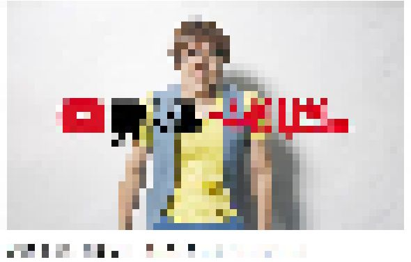
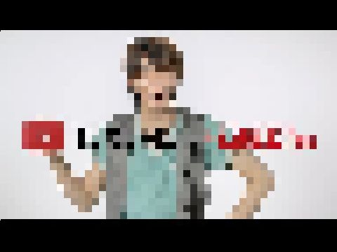
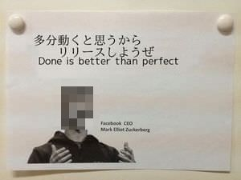

## 自己紹介

---

## 飽き性とは
+++
- 飽きっぽい
+++
- 堪え性がない
+++
- つらいこと、苦しいことなどをがまんできる意地、性分。

---

## つらいこと、苦しいことはがまんできません

---

## 好きなことで生きて行く
+++

+++

+++

---

## 今は？
+++
- ほどよく幸せです
- 好きなようにプログラミングできている|
- 旅行関係のサービスの開発、運用ができている|
- ある程度融通がきく|
- youtubeを見て１日が終わります（冗談です）
- 「多分動くと思うからリリースしようぜ」という精神が通じる|
|
- 基本的に色々ぶっ込むけどCTOに止められる|

---

## 最終的にどうなりたいか

そこら辺の公園で「昔はお前のようなエンジニアだったのだが、膝に矢を受けてしまってな…」と言ってる老人になりたい

---

## 節目でなりたい自分をイメージする
+++
- 節目といえば10歳ごと
+++
- 30歳
  - 沖縄に移住している
  - スキューバのインストラクター
+++
- 40歳
    - 北海道に移住している
    - 狩猟免許を取得しモンスターハンターになっている
+++
- 50歳
  - 未定
+++
- 60歳
  - 未定
+++
- 70歳
  - 未定
+++
- 80歳 ~ 死ぬまで
    - 「最終的にどうなりたいか」を参照

---

## タイトル回収のため
+++
- 飽き性とは裏を返せば好奇心旺盛
- 情報は広く集める傾向にある（俺調べ、調査サンプル俺）
- 結論、仕事で扱っている言語以外を土日にやる
- swiftとかcとかcrystalとか
- メインはサーバサイドだけど、フロントもやってみる
- vueとかreactとか
- 新しいことに触れること自体楽しい
- 聞いたことあるかもって感じの言語はだいたいチュートリアルがある
  - リンク貼っとけ
- 炎上してる記事のコメント欄をひたすら眺める
  - マウントの取り合いは端から見ていると面白い
- とりあえずその道の有名人をツイッターをフォローしとく
- いろんなコミュニティに参加してみる
  - 身内感があるのはあんまりオススメしない（貴族会も例外ではない）
  - 話の輪に入りづらいため
  - オススメはカンファレンス
  - 僕はいろんなカンファレンスに客やスタッフで参加している
- １週間のうち１日だけプログラミングをしない日を決める
  - 人間関係同様に距離が近すぎてもね・・・？
- コード書いててわからなければスパッと諦める
  - 15分くらい考えてもわからない場合
  - 実装したい処理は１日おけばふと解決するかも

---

## 結論
+++
- 自分本位であれ
- 他人は気にするな

