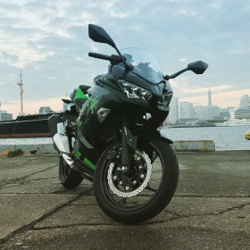

## 飽き性でもプログラミングがしたい

t.oda

2018/12/1

---

## 自己紹介
+++

[トラベルブック株式会社](www.travelbook.co.jp)にてPHP、Rubyがメインで旅行関連のメタサーチとキュレーションの開発、運営

+++

最近バイクを買って乗りたい欲がすごい

---

## 飽き性とは
+++
- 物事に飽きやすい性質。（出典：三省堂 大辞林）
- 何でもすぐ飽きが来る性格。または、そうした性分の人。（出典：実用日本語表現辞典）|
- 特定のものに対する興味や好意が長続きせず、対象が色々に変わるさま（出典：weblio）|

---

## やってることがつまらなかったり、好きじゃなかったりする

---

## 好きなことで生きて行く
+++

+++

---

## 今は？
+++
- ほどよく幸せです
- 好きなようにプログラミングできている|
- 旅行関係のサービスの開発、運用ができている|
- ある程度融通がきく|
- 「多分動くと思うからリリースしようぜ」|
|

---

## 最終的にどうなりたいか
+++
そこら辺の公園で「昔はお前のようなエンジニアだったのだが、膝に矢を受けてしまってな…」と言ってる老人になりたい

---

## 節目でなりたい自分をイメージする
+++
節目といえば10歳ごと
+++
### 30歳
- 沖縄に移住している
- スキューバのインストラクター
+++
### 40歳
- 北海道に移住している
- 狩猟免許を取得しモンスターハンターになっている
+++
### 50歳
- 未定
+++
### 60歳
- 未定
+++
### 70歳
- 未定
+++
### 80歳 ~ 死ぬまで
- NPC
- 「最終的にどうなりたいか」を参照

---

## タイトル回収のため
+++
- 飽き性とは裏を返せば好奇心旺盛
- 新しいことに触れること自体楽しい|
- 情報は広く集める傾向にある（俺調べ、調査サンプル俺）|
+++
- 結論、仕事で扱っている言語以外を仕事外でやる
  - swiftとかcとかcrystalとかGoとか|
- メインはサーバサイドだけど、フロントもやってみる|
  - javascriptしかりvueしかりreactしかり|
- 聞いたことあるかもって感じの言語はだいたいチュートリアルがある|
  - TODO: リンク|
- とりあえずその道の有名人のツイッターをフォローしとく|
+++
- いろんなコミュニティに参加してみる
  - 身内感があるのはあんまりオススメしない|
  - 話の輪に入りづらいため|
- オススメはカンファレンス|
  - 技術のお祭り|
  - 身内感を感じづらい|
  - 一人で行っても楽しめる|
  - 地方開催はプチ旅行もできる|
+++
### PHPカンファレンスは12/15（土）
+++
- １週間のうち少なくとも１日はプログラミングをしない日を決める
  - 人間関係同様に距離が近すぎてもね・・・？|
- コード書いててわからなければスパッと諦める|
  - 15分くらい考えてもわからない場合|
  - 実装したい処理は１日おけばふと解決するかも|

---

## 結論
+++
### 自分本位であれ

飽き性とは好奇心の裏返し

---

## *Fin*

